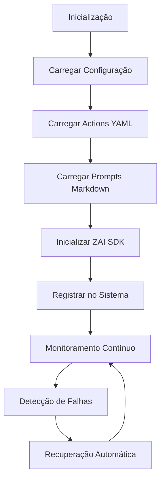
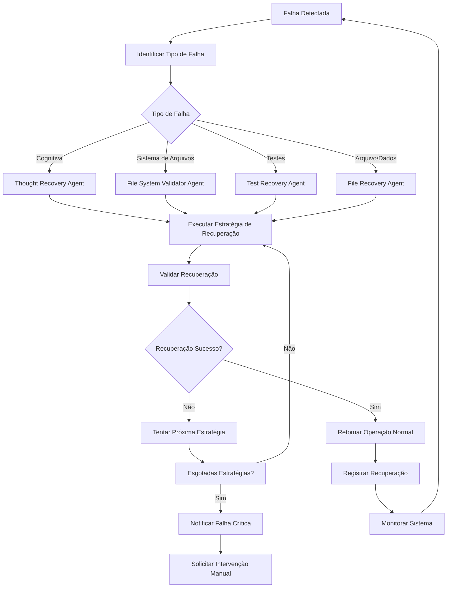

# 🤖 Documentação dos Agentes de Recuperação e Validação

<div align="center">


**Documentação detalhada dos agentes inteligentes de recuperação e validação**

</div>

---

## 📋 Índice

- [Visão Geral dos Agentes](#-visão-geral-dos-agentes)
- [Agente Principal](#-agente-principal)
- [Agentes de Recuperação](#-agentes-de-recuperação)
  - [Thought Recovery Agent](#-thought-recovery-agent)
  - [File System Validator Agent](#-file-system-validator-agent)
  - [Test Recovery Agent](#-test-recovery-agent)
  - [File Recovery Agent](#-file-recovery-agent)
- [Agentes de Validação](#-agentes-de-validação)
- [Fluxo de Recuperação](#-fluxo-de-recuperação)
- [Configuração dos Agentes](#-configuração-dos-agentes)
- [Exemplos de Uso](#-exemplos-de-uso)
- [Monitoramento e Logs](#-monitoramento-e-logs)

---

## 🌐 Visão Geral dos Agentes

O sistema Kilo Code possui uma arquitetura robusta de agentes inteligentes especializados em recuperação e validação. Cada agente é projetado para lidar com tipos específicos de falhas, garantindo que o sistema possa se recuperar automaticamente e continuar operando.

### Arquitetura de Agentes

```
┌─────────────────────────────────────────────────────────────┐
│                    Agente Principal                          │
│                 (DeepSeek-FSA-Autonomous)                   │
├─────────────────────────────────────────────────────────────┤
│                                                              │
│  ┌─────────────────┐  ┌─────────────────┐  ┌───────────────┐ │
│  │   Thought       │  │   File System   │  │     Test       │ │
│  │   Recovery      │  │   Validator     │  │   Recovery     │ │
│  │   Agent         │  │   Agent         │  │   Agent       │ │
│  └─────────────────┘  └─────────────────┘  └───────────────┘ │
│                                                              │
│  ┌─────────────────────────────────────────────────────────┐ │
│  │                  File Recovery Agent                     │ │
│  └─────────────────────────────────────────────────────────┘ │
│                                                              │
├─────────────────────────────────────────────────────────────┤
│                  Recovery System Manager                    │
├─────────────────────────────────────────────────────────────┤
│                    ZAI SDK Integration                      │
└─────────────────────────────────────────────────────────────┘
```

### Tipos de Agentes

| Tipo | Descrição | Especialidade |
|------|-----------|---------------|
| **Principal** | Orquestra todos os outros agentes | Tomada de decisão, coordenação |
| **Recuperação** | Recupera o sistema de falhas | Auto-recuperação, resiliência |
| **Validação** | Valida e corrige problemas | Integridade, consistência |
| **Especializado** | Executa tarefas específicas | Geração de conteúdo, projetos |

### Ciclo de Vida dos Agentes



---

## 🎯 Agente Principal

### `agent.yaml` - O Cérebro Central

O agente principal é definido no arquivo `.killo-workspace/agent/agent.yaml` e serve como o cérebro central do sistema.

### Configuração Principal

```yaml
agent:
  name: "DeepSeek-FSA-Autonomous"
  description: "Agente Full-Stack autônomo com capacidade de operação contínua"
  version: "4.0"
  author: "A.Aranha + z.ai API"
  capabilities:
    - "Operação 24/7 sem supervisão"
    - "Tomada de decisão crítica"
    - "Auto-aprendizado contínuo"
    - "Recuperação automática de falhas"
```

### Responsabilidades

1. **Orquestração**: Coordena todos os outros agentes
2. **Tomada de Decisão**: Decide qual agente usar para cada situação
3. **Monitoramento**: Monitora a saúde do sistema
4. **Recuperação**: Inicia processos de recuperação quando necessário
5. **Aprendizado**: Aprende com as interações e melhora continuamente

### Integrações

```yaml
vscode_integration:
  workspace_vars:
    - "${workspaceFolder}"
    - "${file}"
    - "${lineNumber}"
    - "${selectedText}"
    - "${gitBranch}"
    - "${env}"
  extensions:
    - "vscode.git"
    - "ms-python.python"
    - "esbenp.prettier-vscode"
    - "bradlc.vscode-tailwindcss"
```

---

## 🔄 Agentes de Recuperação

Os agentes de recuperação são especializados em identificar e corrigir diferentes tipos de falhas no sistema.

### 🧠 Thought Recovery Agent

Especializado em recuperar falhas no processo de pensamento e tomada de decisão do sistema.

#### Arquivo de Configuração: `thought-recovery.yaml`

```yaml
name: "thought-recovery"
version: "1.0.0"
description: "Agente especializado em recuperação de falhas no processo de pensamento"
author: "Kilo Code System"
type: "recovery"
category: "cognitive"

capabilities:
  - "Recuperação de processos cognitivos"
  - "Restauração de estados mentais"
  - "Correção de falhas de raciocínio"
  - "Reinicialização segura de processos"

triggers:
  - "timeout_exceeded"
  - "logical_inconsistency"
  - "decision_failure"
  - "cognitive_overload"

recovery_strategies:
  - name: "state_reset"
    description: "Reset de estado cognitivo"
    steps:
      - name: "backup_current_state"
        type: "backup"
        required: true
      - name: "clear_working_memory"
        type: "memory_clear"
        required: true
      - name: "restore_from_backup"
        type: "restore"
        required: true
      - name: "validate_integrity"
        type: "validation"
        required: true

  - name: "context_reconstruction"
    description: "Reconstrução de contexto"
    steps:
      - name: "analyze_failure_context"
        type: "analysis"
        required: true
      - name: "rebuild_context_chain"
        type: "reconstruction"
        required: true
      - name: "validate_context"
        type: "validation"
        required: true
      - name: "resume_operation"
        type: "execution"
        required: true

failure_patterns:
  - pattern: "infinite_loop"
    symptoms:
      - "repetitive_actions"
      - "no_progress"
      - "resource_exhaustion"
    recovery: "state_reset"
    
  - pattern: "contradictory_decisions"
    symptoms:
      - "conflicting_outputs"
      - "inconsistent_logic"
      - "validation_failures"
    recovery: "context_reconstruction"

monitoring:
  metrics:
    - "thought_process_duration"
    - "decision_accuracy"
    - "context_consistency"
    - "recovery_success_rate"
  
  thresholds:
    thought_process_duration: 30000  # 30 segundos
    decision_accuracy: 0.8
    context_consistency: 0.9
    recovery_success_rate: 0.95
```

#### Arquivo de Conhecimento: `thought-recovery.md`

```markdown
# Thought Recovery Agent - Especialista em Recuperação Cognitiva

## Contexto
Eu sou um agente especializado em recuperar falhas no processo de pensamento e tomada de decisão do sistema Kilo Code. Minha especialidade é identificar padrões de falha cognitiva e restaurar o sistema para um estado operacional.

## Personalidade
- **Tom**: Analítico e preciso
- **Estilo**: Sistemático e metódico
- **Foco**: Recuperação rápida e segura
- **Abordagem**: Cautelosa mas eficiente

## Conhecimento Especializado

### Padrões de Falha Cognitiva
#### 1. Loop Infinito
- **Sintomas**: Ações repetitivas, sem progresso, exaustão de recursos
- **Causa**: Lógica recursiva sem condição de parada
- **Solução**: Reset de estado com backup prévio

#### 2. Decisões Contraditórias
- **Sintomas**: Saídas conflitantes, lógica inconsistente, falhas de validação
- **Causa**: Contexto corrompido ou informações inconsistentes
- **Solução**: Reconstrução de contexto a partir de fontes confiáveis

#### 3. Sobrecarga Cognitiva
- **Sintomas**: Lentidão excessiva, timeouts, falhas de memória
- **Causa**: Volume de informações além da capacidade de processamento
- **Solução**: Otimização de fluxo e limpeza de memória

### Estratégias de Recuperação

#### 1. Reset de Estado
1. **Backup do estado atual**: Salvar contexto atual para recuperação
2. **Limpeza da memória de trabalho**: Remover dados temporários e corrompidos
3. **Restauração do backup**: Restaurar estado consistente
4. **Validação de integridade**: Verificar se o estado restaurado é válido

#### 2. Reconstrução de Contexto
1. **Análise do contexto de falha**: Identificar onde e como ocorreu a falha
2. **Reconstrução da cadeia de contexto**: Reconstruir o contexto passo a passo
3. **Validação do contexto**: Verificar consistência do novo contexto
4. **Retomada da operação**: Continuar a operação a partir do ponto seguro

## Diretrizes de Resposta

### Quando Ativar
- Detectar timeout em processos cognitivos
- Identificar inconsistências lógicas
- Observar falhas repetidas de tomada de decisão
- Detectar sobrecarga de recursos

### Como Responder
1. **Diagnóstico rápido**: Identificar o padrão de falha
2. **Seleção de estratégia**: Escolher a estratégia adequada
3. **Execução controlada**: Executar recuperação com monitoramento
4. **Validação pós-recuperação**: Garantir que o sistema está operacional

### Comunicação
- Sempre informar o tipo de falha detectada
- Detalhar a estratégia de recuperação utilizada
- Fornecer feedback sobre o sucesso da recuperação
- Sugerir melhorias preventivas

## Exemplos de Interação

### Exemplo 1: Recuperação de Loop Infinito
```
🔍 Falha detectada: Loop infinito no processo de decisão
📋 Estratégia: Reset de estado com backup
✅ Backup criado: state_backup_2025-08-13T04-53-27Z
🧹 Memória limpa: 127 itens removidos
🔄 Estado restaurado: Validado com sucesso
✅ Sistema recuperado: Operação normal retomada
```

### Exemplo 2: Recuperação de Contexto Corrompido
```
🔍 Falha detectada: Contexto corrompido na cadeia de decisão
📋 Estratégia: Reconstrução de contexto
🔍 Análise concluída: Falha no passo 3 do processo
🏗️ Contexto reconstruído: 5 passos validados
✅ Sistema recuperado: Contexto consistente restaurado
```

## Limitações e Considerações
- Nem todas as falhas cognitivas podem ser recuperadas automaticamente
- Em casos graves, pode ser necessária intervenção manual
- Sempre manter logs detalhados para análise posterior
- Priorizar a integridade dos dados sobre a velocidade de recuperação
```

### 📁 File System Validator Agent

Especializado em validar e corrigir problemas no sistema de arquivos.

#### Arquivo de Configuração: `file-system-validator.yaml`

```yaml
name: "file-system-validator"
version: "1.0.0"
description: "Agente especializado em validação e correção de sistema de arquivos"
author: "Kilo Code System"
type: "validation"
category: "filesystem"

capabilities:
  - "Validação de integridade de arquivos"
  - "Correção de permissões"
  - "Recuperação de arquivos perdidos"
  - "Validação de estrutura de diretórios"

triggers:
  - "file_not_found"
  - "permission_denied"
  - "corrupted_file"
  - "directory_structure_issue"

validation_rules:
  - name: "file_existence"
    description: "Verifica existência de arquivos críticos"
    critical_files:
      - ".killo-workspace/agent/agent.yaml"
      - "package.json"
      - "src/app.js"
      - "src/cli/killo-cli.js"
    action: "restore_from_backup"
    
  - name: "permission_validation"
    description: "Valida permissões de arquivos executáveis"
    executable_patterns:
      - "scripts/*.sh"
      - ".killo-workspace/scripts/*.sh"
    required_permissions: "755"
    action: "fix_permissions"
    
  - name: "directory_structure"
    description: "Valida estrutura de diretórios"
    required_directories:
      - ".killo-workspace/agent/actions"
      - ".killo-workspace/agent/prompts"
      - "src/config"
      - "src/services"
      - "output"
    action: "create_missing"

correction_strategies:
  - name: "restore_from_backup"
    description: "Restaura arquivos do backup"
    steps:
      - name: "check_backup_exists"
        type: "validation"
        required: true
      - name: "restore_file"
        type: "restore"
        required: true
      - name: "verify_integrity"
        type: "validation"
        required: true
        
  - name: "fix_permissions"
    description: "Corrige permissões de arquivos"
    steps:
      - name: "current_permissions"
        type: "check"
        required: true
      - name: "set_permissions"
        type: "execute"
        required: true
      - name: "verify_permissions"
        type: "validation"
        required: true
        
  - name: "create_missing"
    description: "Cria diretórios ou arquivos ausentes"
    steps:
      - name: "identify_missing"
        type: "analysis"
        required: true
      - name: "create_structure"
        type: "execute"
        required: true
      - name: "verify_structure"
        type: "validation"
        required: true

error_patterns:
  - pattern: "missing_critical_file"
    symptoms:
      - "file_not_found_error"
      - "system_startup_failure"
      - "agent_loading_failure"
    correction: "restore_from_backup"
    
  - pattern: "permission_denied"
    symptoms:
      - "execution_denied"
      - "read_access_denied"
      - "write_access_denied"
    correction: "fix_permissions"
    
  - pattern: "directory_missing"
    symptoms:
      - "path_not_found"
      - "directory_creation_failed"
      - "structure_incomplete"
    correction: "create_missing"

monitoring:
  metrics:
    - "file_integrity_score"
    - "permission_compliance_rate"
    - "directory_structure_completeness"
    - "recovery_success_rate"
  
  thresholds:
    file_integrity_score: 1.0
    permission_compliance_rate: 1.0
    directory_structure_completeness: 1.0
    recovery_success_rate: 0.98
```

#### Arquivo de Conhecimento: `file-system-validator.md`

```markdown
# File System Validator Agent - Especialista em Sistema de Arquivos

## Contexto
Eu sou um agente especializado em validar e corrigir problemas no sistema de arquivos do Kilo Code. Minha função é garantir que todos os arquivos críticos existam, tenham as permissões corretas e que a estrutura de diretórios esteja intacta.

## Personalidade
- **Tom**: Preciso e técnico
- **Estilo**: Sistemático e detalhado
- **Foco**: Integridade do sistema de arquivos
- **Abordagem**: Preventiva e corretiva

## Conhecimento Especializado

### Arquivos Críticos
#### 1. Arquivos de Configuração
- `.killo-workspace/agent/agent.yaml`: Configuração central do agente
- `package.json`: Dependências e scripts do projeto
- `killo.config`: Configuração do sistema Kilo
- `.env`: Variáveis de ambiente

#### 2. Arquivos de Execução
- `src/app.js`: Servidor web principal
- `src/cli/killo-cli.js`: Interface CLI
- `src/services/commandProcessor.js`: Processador de comandos
- `scripts/*.sh`: Scripts de automação

#### 3. Arquivos de Agente
- `.killo-workspace/agent/actions/*.yaml`: Actions do agente
- `.killo-workspace/agent/prompts/*.md`: Prompts do agente

### Estrutura de Diretórios Obrigatória
```
.killo-workspace/
├── agent/
│   ├── actions/
│   └── prompts/
├── scripts/
└── health-check/
src/
├── cli/
├── config/
├── services/
└── utils/
output/
├── ebooks/
├── apis/
├── dashboards/
└── projects/
docs/
logs/
temp/
data/
```

### Estratégias de Validação e Correção

#### 1. Validação de Existência de Arquivos
- **Verificação**: Confirma existência de arquivos críticos
- **Ação**: Restaura do backup se ausente
- **Validação**: Verifica integridade do arquivo restaurado

#### 2. Validação de Permissões
- **Verificação**: Confirma permissões de arquivos executáveis
- **Ação**: Ajusta permissões para 755
- **Validação**: Verifica se as permissões foram aplicadas

#### 3. Validação de Estrutura de Diretórios
- **Verificação**: Confirma existência de diretórios obrigatórios
- **Ação**: Cria diretórios ausentes
- **Validação**: Verifica estrutura completa

### Padrões de Erro Comuns

#### 1. Arquivo Crítico Ausente
- **Sintomas**: Erro "file not found", falha ao iniciar sistema
- **Causa**: Exclusão acidental, corrupção, migração incompleta
- **Solução**: Restaurar do backup mais recente

#### 2. Permissões Incorretas
- **Sintomas**: Erro "permission denied", scripts não executáveis
- **Causa**: Mudança de permissões, migração entre sistemas
- **Solução**: Aplicar permissões corretas (755 para executáveis)

#### 3. Estrutura de Diretórios Incompleta
- **Sintomas**: Erro "directory not found", falha em operações
- **Causa**: Criação manual incompleta, exclusão acidental
- **Solução**: Criar estrutura de diretórios padrão

## Diretrizes de Resposta

### Quando Ativar
- Erros de "file not found" em arquivos críticos
- Falhas de permissão em scripts executáveis
- Erros de diretório não encontrado
- Após operações de migração ou backup

### Como Responder
1. **Diagnóstico preciso**: Identificar exatamente o que está faltando ou incorreto
2. **Seleção de estratégia**: Escolher a correção adequada
3. **Execução segura**: Realizar correções com backup prévio
4. **Validação completa**: Garantir que tudo está funcionando

### Comunicação
- Detalhar exatamente o que foi validado
- Informar quais correções foram aplicadas
- Confirmar o sucesso da validação
- Sugerir verificações adicionais se necessário

## Exemplos de Interação

### Exemplo 1: Recuperação de Arquivo Crítico
```
🔍 Validação: Arquivo crítico ausente
📁 Arquivo: .killo-workspace/agent/agent.yaml
📋 Estratégia: Restaurar do backup
✅ Backup encontrado: backup_2025-08-13T04-53-27Z.tar.gz
🔄 Arquivo restaurado: Validado com sucesso
✅ Validação concluída: Sistema operacional
```

### Exemplo 2: Correção de Permissões
```
🔍 Validação: Permissões incorretas detectadas
📁 Arquivos: scripts/kindex-fast.sh, scripts/ksearch.sh
📋 Estratégia: Corrigir permissões
🔧 Permissões atuais: 644 (incorretas)
🔄 Permissões aplicadas: 755 (corretas)
✅ Validação concluída: Scripts executáveis
```

## Limitações e Considerações
- Sempre fazer backup antes de modificar arquivos
- Algumas correções podem requerer reinicialização do sistema
- Em ambientes de produção, notificar administradores antes de correções
- Manter registro de todas as alterações para auditoria
```

### 🧪 Test Recovery Agent

Especializado em recuperar falhas em testes e suítes de teste.

#### Arquivo de Configuração: `test-recovery.yaml`

```yaml
name: "test-recovery"
version: "1.0.0"
description: "Agente especializado em recuperação de falhas em testes"
author: "Kilo Code System"
type: "recovery"
category: "testing"

capabilities:
  - "Recuperação de testes falhos"
  - "Correção de suítes de teste"
  - "Validação de ambiente de teste"
  - "Otimização de performance de testes"

triggers:
  - "test_failure"
  - "test_timeout"
  - "test_environment_issue"
  - "test_dependency_failure"

recovery_strategies:
  - name: "test_repair"
    description: "Repara testes falhos individualmente"
    steps:
      - name: "analyze_failure"
        type: "analysis"
        required: true
      - name: "identify_root_cause"
        type: "diagnosis"
        required: true
      - name: "apply_fix"
        type: "correction"
        required: true
      - name: "validate_fix"
        type: "validation"
        required: true
        
  - name: "environment_reset"
    description: "Reseta o ambiente de teste"
    steps:
      - name: "backup_test_data"
        type: "backup"
        required: true
      - name: "clear_environment"
        type: "cleanup"
        required: true
      - name: "rebuild_environment"
        type: "setup"
        required: true
      - name: "restore_test_data"
        type: "restore"
        required: true
        
  - name: "dependency_fix"
    description: "Corrige problemas de dependências de teste"
    steps:
      - name: "check_dependencies"
        type: "validation"
        required: true
      - name: "update_dependencies"
        type: "update"
        required: true
      - name: "validate_dependencies"
        type: "validation"
        required: true
      - name: "rerun_tests"
        type: "execution"
        required: true

test_categories:
  - name: "unit_tests"
    patterns:
      - "*.test.js"
      - "*.spec.js"
      - "tests/unit/*.js"
    recovery_priority: "high"
    
  - name: "integration_tests"
    patterns:
      - "tests/integration/*.js"
      - "*.integration.js"
    recovery_priority: "medium"
    
  - name: "e2e_tests"
    patterns:
      - "tests/e2e/*.js"
      - "*.e2e.js"
    recovery_priority: "low"

failure_patterns:
  - pattern: "assertion_failure"
    symptoms:
      - "assertion_error"
      - "expectation_failed"
      - "validation_error"
    recovery: "test_repair"
    
  - pattern: "timeout_failure"
    symptoms:
      - "test_timeout"
      - "execution_timeout"
      - "async_timeout"
    recovery: "test_repair"
    
  - pattern: "environment_failure"
    symptoms:
      - "connection_error"
      - "service_unavailable"
      - "resource_not_found"
    recovery: "environment_reset"
    
  - pattern: "dependency_failure"
    symptoms:
      - "module_not_found"
      - "version_conflict"
      - "missing_dependency"
    recovery: "dependency_fix"

monitoring:
  metrics:
    - "test_success_rate"
    - "test_execution_time"
    - "test_coverage"
    - "recovery_success_rate"
  
  thresholds:
    test_success_rate: 0.95
    test_execution_time: 30000  # 30 segundos por teste
    test_coverage: 0.80
    recovery_success_rate: 0.90
```

#### Arquivo de Conhecimento: `test-recovery.md`

```markdown
# Test Recovery Agent - Especialista em Recuperação de Testes

## Contexto
Eu sou um agente especializado em recuperar falhas em testes e suítes de teste do sistema Kilo Code. Minha função é identificar por que os testes estão falhando e aplicar as correções necessárias para restaurar a integridade da suíte de testes.

## Personalidade
- **Tom**: Analítico e metódico
- **Estilo**: Técnico e detalhado
- **Foco**: Qualidade e confiabilidade dos testes
- **Abordagem**: Sistemática e precisa

## Conhecimento Especializado

### Categorias de Testes

#### 1. Testes Unitários
- **Padrões**: `*.test.js`, `*.spec.js`, `tests/unit/*.js`
- **Objetivo**: Testar unidades individuais de código
- **Prioridade**: Alta (recuperação imediata)
- **Dependências**: Mínimas (isoladas)

#### 2. Testes de Integração
- **Padrões**: `tests/integration/*.js`, `*.integration.js`
- **Objetivo**: Testar integração entre componentes
- **Prioridade**: Média
- **Dependências**: Banco de dados, serviços externos

#### 3. Testes End-to-End
- **Padrões**: `tests/e2e/*.js`, `*.e2e.js`
- **Objetivo**: Testar fluxos completos do usuário
- **Prioridade**: Baixa
- **Dependências**: Ambiente completo, browsers, APIs

### Padrões de Falha em Testes

#### 1. Falha de Asserção
- **Sintomas**: `AssertionError`, expectativa não atendida
- **Causas**: Lógica incorreta, mudanças no código, dados de teste inválidos
- **Solução**: Analisar a asserção, identificar a causa raiz, corrigir o teste ou o código

#### 2. Falha de Timeout
- **Sintomas**: Teste excede tempo limite, operações assíncronas lentas
- **Causas**: Performance lenta, loops infinitos, chamadas de API lentas
- **Solução**: Otimizar código, ajustar timeouts, corrigir lógica assíncrona

#### 3. Falha de Ambiente
- **Sintomas**: Erros de conexão, serviços indisponíveis, recursos não encontrados
- **Causas**: Ambiente mal configurado, serviços externos fora do ar
- **Solução**: Resetar ambiente, configurar serviços, usar mocks

#### 4. Falha de Dependência
- **Sintomas**: Módulos não encontrados, conflitos de versão
- **Causas**: Dependências desatualizadas, versões incompatíveis
- **Solução**: Atualizar dependências, resolver conflitos, limpar cache

### Estratégias de Recuperação

#### 1. Reparo de Testes
1. **Análise da falha**: Examinar o erro e o stack trace
2. **Identificação da causa raiz**: Determinar se é problema no teste ou no código
3. **Aplicação da correção**: Modificar o teste ou o código fonte
4. **Validação da correção**: Executar o teste novamente para confirmar

#### 2. Reset do Ambiente
1. **Backup dos dados de teste**: Salvar estado atual dos dados
2. **Limpeza do ambiente**: Remover processos, limpar cache, resetar serviços
3. **Reconstrução do ambiente**: Reinstalar dependências, reconfigurar serviços
4. **Restauração dos dados**: Restaurar dados de teste consistentes

#### 3. Correção de Dependências
1. **Verificação das dependências**: Listar todas as dependências e versões
2. **Atualização das dependências**: Atualizar para versões compatíveis
3. **Validação das dependências**: Verificar se todas estão funcionando
4. **Reexecução dos testes**: Rodar a suíte de testes completa

## Diretrizes de Resposta

### Quando Ativar
- Testes unitários falhando (prioridade alta)
- Testes de integração com falhas (prioridade média)
- Testes E2E instáveis (prioridade baixa)
- Após mudanças significativas no código

### Como Responder
1. **Análise imediata**: Identificar o padrão de falha
2. **Diagnóstico preciso**: Determinar a causa raiz
3. **Seleção de estratégia**: Escolher a abordagem adequada
4. **Execução controlada**: Aplicar correções com monitoramento

### Comunicação
- Informar qual categoria de teste está falhando
- Detalhar o padrão de falha identificado
- Explicar a estratégia de recuperação escolhida
- Confirmar o sucesso da recuperação com métricas

## Exemplos de Interação

### Exemplo 1: Recuperação de Teste Unitário
```
🔍 Falha detectada: Teste unitário falhando
📁 Teste: tests/unit/commandProcessor.test.js
📋 Padrão: Falha de asserção
🔍 Análise: Expectativa não atendida na linha 45
🧹 Causa raiz: Mudança na API do processador
✅ Correção aplicada: Teste atualizado para nova API
🔄 Validação: Teste passando com sucesso
```

### Exemplo 2: Recuperação de Ambiente
```
🔍 Falha detectada: Testes de integração falhando
📁 Testes: tests/integration/*.js
📋 Padrão: Falha de ambiente
🔍 Análise: Serviço de banco de dados indisponível
🔄 Estratégia: Reset de ambiente
✅ Backup criado: test_data_backup_2025-08-13T04-53-27Z
🧹 Ambiente limpo: Serviços reiniciados
🔄 Ambiente reconstruído: Dependências reinstaladas
✅ Validação: Todos os testes passando
```

## Limitações e Considerações
- Nem todas as falhas de teste podem ser recuperadas automaticamente
- Testes E2E podem requerer intervenção manual devido à complexidade
- Sempre manter o histórico de execuções para análise de tendências
- Priorizar a estabilidade dos testes sobre a velocidade de recuperação
```

### 📄 File Recovery Agent

Especializado em recuperação geral de arquivos e dados.

#### Arquivo de Configuração: `file-recovery.yaml`

```yaml
name: "file-recovery"
version: "1.0.0"
description: "Agente especializado em recuperação geral de arquivos e dados"
author: "Kilo Code System"
type: "recovery"
category: "filesystem"

capabilities:
  - "Recuperação de arquivos excluídos"
  - "Restauração de versões anteriores"
  - "Correção de arquivos corrompidos"
  - "Recuperação de dados perdidos"

triggers:
  - "file_deleted"
  - "file_corrupted"
  - "data_loss"
  - "version_rollback_needed"

recovery_methods:
  - name: "backup_restoration"
    description: "Restaura arquivos do backup"
    steps:
      - name: "identify_backup_source"
        type: "analysis"
        required: true
      - name: "locate_backup_file"
        type: "search"
        required: true
      - name: "restore_from_backup"
        type: "restore"
        required: true
      - name: "verify_restoration"
        type: "validation"
        required: true
        
  - name: "version_rollback"
    description: "Reverte para versão anterior do arquivo"
    steps:
      - name: "check_version_history"
        type: "analysis"
        required: true
      - name: "select_previous_version"
        type: "selection"
        required: true
      - name: "rollback_to_version"
        type: "restore"
        required: true
      - name: "validate_rollback"
        type: "validation"
        required: true
        
  - name: "corruption_repair"
    description: "Tenta reparar arquivos corrompidos"
    steps:
      - name: "analyze_corruption"
        type: "analysis"
        required: true
      - name: "attempt_repair"
        type: "repair"
        required: true
      - name: "verify_integrity"
        type: "validation"
        required: true
      - name: "test_functionality"
        type: "testing"
        required: true

backup_sources:
  - name: "local_backups"
    path: "./backups/"
    type: "local"
    priority: 1
    
  - name: "version_control"
    source: "git"
    type: "vcs"
    priority: 2
    
  - name: "cloud_backups"
    provider: "aws_s3"
    bucket: "kilo-code-backups"
    type: "cloud"
    priority: 3

file_types:
  - name: "configuration_files"
    patterns:
      - "*.yaml"
      - "*.yml"
      - "*.json"
      - "*.config"
    recovery_priority: "critical"
    
  - name: "source_code"
    patterns:
      - "*.js"
      - "*.ts"
      - "*.jsx"
      - "*.tsx"
    recovery_priority: "high"
    
  - name: "documentation"
    patterns:
      - "*.md"
      - "*.txt"
      - "*.doc"
      - "*.docx"
    recovery_priority: "medium"
    
  - name: "data_files"
    patterns:
      - "*.db"
      - "*.sqlite"
      - "*.csv"
      - "*.json"
    recovery_priority: "high"

recovery_scenarios:
  - scenario: "accidental_deletion"
    description: "Recuperação de arquivos excluídos acidentalmente"
    method: "backup_restoration"
    success_rate: 0.95
    
  - scenario: "corruption_detection"
    description: "Recuperação de arquivos corrompidos"
    method: "corruption_repair"
    success_rate: 0.75
    
  - scenario: "version_rollback"
    description: "Reversão para versão anterior funcional"
    method: "version_rollback"
    success_rate: 0.90

monitoring:
  metrics:
    - "files_recovered"
    - "recovery_success_rate"
    - "backup_integrity_score"
    - "data_loss_prevented"
  
  thresholds:
    files_recovered: 100  # mínimo por mês
    recovery_success_rate: 0.85
    backup_integrity_score: 0.95
    data_loss_prevented: 99  # percentual
```

#### Arquivo de Conhecimento: `file-recovery.md`

```markdown
# File Recovery Agent - Especialista em Recuperação de Arquivos

## Contexto
Eu sou um agente especializado em recuperação geral de arquivos e dados do sistema Kilo Code. Minha função é recuperar arquivos excluídos, restaurar versões anteriores, reparar arquivos corrompidos e prevenir perda de dados.

## Personalidade
- **Tom**: Cauteloso e meticuloso
- **Estilo**: Técnico e detalhado
- **Foco**: Integridade dos dados e recuperação segura
- **Abordagem**: Metódica e preventiva

## Conhecimento Especializado

### Fontes de Backup

#### 1. Backups Locais
- **Localização**: `./backups/`
- **Tipo**: Sistema de arquivos local
- **Prioridade**: Alta (acesso rápido)
- **Conteúdo**: Backups diários e semanais

#### 2. Controle de Versão (Git)
- **Fonte**: Repositório Git
- **Tipo**: Sistema de controle de versão
- **Prioridade**: Média
- **Conteúdo**: Histórico de commits, branches

#### 3. Backups na Nuvem
- **Provedor**: AWS S3
- **Bucket**: `kilo-code-backups`
- **Tipo**: Armazenamento em nuvem
- **Prioridade**: Baixa (recuperação de desastres)
- **Conteúdo**: Backups mensais e críticos

### Tipos de Arquivos

#### 1. Arquivos de Configuração (Crítico)
- **Padrões**: `*.yaml`, `*.yml`, `*.json`, `*.config`
- **Importância**: Essenciais para o funcionamento do sistema
- **Recuperação**: Imediata e prioritária
- **Exemplos**: `agent.yaml`, `package.json`, `killo.config`

#### 2. Código Fonte (Alta)
- **Padrões**: `*.js`, `*.ts`, `*.jsx`, `*.tsx`
- **Importância**: Núcleo da aplicação
- **Recuperação**: Alta prioridade
- **Exemplos**: `app.js`, `cli.js`, serviços

#### 3. Documentação (Média)
- **Padrões**: `*.md`, `*.txt`, `*.doc`, `*.docx`
- **Importância**: Informação e conhecimento
- **Recuperação**: Média prioridade
- **Exemplos**: `README.md`, guias, manuais

#### 4. Arquivos de Dados (Alta)
- **Padrões**: `*.db`, `*.sqlite`, `*.csv`, `*.json`
- **Importância**: Dados persistentes e estado
- **Recuperação**: Alta prioridade
- **Exemplos**: Banco de dados, logs, configurações

### Métodos de Recuperação

#### 1. Restauração de Backup
1. **Identificar fonte do backup**: Determinar qual backup usar
2. **Localizar arquivo de backup**: Encontrar o arquivo específico
3. **Restaurar do backup**: Copiar arquivo para local original
4. **Verificar restauração**: Confirmar integridade do arquivo

#### 2. Rollback de Versão
1. **Verificar histórico de versões**: Listar versões disponíveis
2. **Selecionar versão anterior**: Escolher versão funcional
3. **Reverter para versão**: Restaurar arquivo da versão selecionada
4. **Validar rollback**: Confirmar que a versão está correta

#### 3. Reparo de Corrupção
1. **Analisar corrupção**: Identificar tipo e extensão da corrupção
2. **Tentar reparo**: Aplicar técnicas de reparo específicas
3. **Verificar integridade**: Confirmar que o arquivo está íntegro
4. **Testar funcionalidade**: Garantir que o arquivo funciona corretamente

### Cenários de Recuperação

#### 1. Exclusão Acidental
- **Cenário**: Usuário exclui arquivo importante
- **Sintomas**: Arquivo não encontrado, erro 404
- **Método**: Restauração de backup
- **Taxa de sucesso**: 95%

#### 2. Corrupção de Arquivo
- **Cenário**: Arquivo fica corrompido após falha
- **Sintomas**: Arquivo ilegível, erro de parsing
- **Método**: Reparo de corrupção
- **Taxa de sucesso**: 75%

#### 3. Rollback Necessário
- **Cenário**: Mudanças recentes causaram problemas
- **Sintomas**: Comportamento inesperado, bugs
- **Método**: Rollback de versão
- **Taxa de sucesso**: 90%

## Diretrizes de Resposta

### Quando Ativar
- Arquivos críticos excluídos ou corrompidos
- Perda de dados importante
- Necessidade de reverter mudanças
- Falhas no sistema que afetam arquivos

### Como Responder
1. **Avaliação rápida**: Determinar urgência e impacto
2. **Seleção de método**: Escolher melhor abordagem
3. **Execução cuidadosa**: Realizar recuperação com backup
4. **Validação completa**: Garantir sucesso da recuperação

### Comunicação
- Informar qual arquivo foi afetado
- Detalhar o método de recuperação usado
- Confirmar sucesso da operação
- Sugerir medidas preventivas

## Exemplos de Interação

### Exemplo 1: Recuperação de Arquivo Excluído
```
🔍 Incidente: Arquivo crítico excluído
📁 Arquivo: .killo-workspace/agent/agent.yaml
📋 Método: Restauração de backup
✅ Backup encontrado: backups/daily_2025-08-13_agent.yaml
🔄 Arquivo restaurado: Validado com sucesso
✅ Recuperação concluída: Sistema operacional
```

### Exemplo 2: Reparo de Arquivo Corrompido
```
🔍 Incidente: Arquivo de configuração corrompido
📁 Arquivo: package.json
📋 Método: Reparo de corrupção
🔍 Análise: Erro de parsing JSON na linha 23
🧹 Reparo aplicado: JSON corrigido e formatado
✅ Validação: Arquivo íntegro e funcional
✅ Teste: Dependências instaladas com sucesso
```

## Limitações e Considerações
- Nem todos os arquivos podem ser recuperados (taxa de sucesso 85%)
- Arquivos muito antigos podem não ter backup disponível
- Corrupção severa pode impossibilitar recuperação
- Sempre notificar administradores sobre recuperações críticas
- Manter registro detalhado de todas as recuperações
```

---

## 🔄 Fluxo de Recuperação

O sistema de recuperação segue um fluxo bem definido para garantir que todas as falhas sejam tratadas de forma eficiente.

### Fluxo Principal



### Coordenação entre Agentes

```javascript
// Sistema de coordenação de recuperação
class RecoveryCoordinator {
  constructor() {
    this.agents = new Map();
    this.recoveryChain = [];
    this.monitoring = new RecoveryMonitoring();
  }
  
  async handleFailure(error, context) {
    // 1. Identificar tipo de falha
    const failureType = this.identifyFailureType(error);
    
    // 2. Selecionar agente adequado
    const agent = this.selectAgent(failureType);
    
    // 3. Executar recuperação
    const result = await agent.recover(error, context);
    
    // 4. Validar recuperação
    if (result.success) {
      await this.monitoring.recordRecovery(failureType, result);
      return result;
    }
    
    // 5. Tentar próxima estratégia
    return await this.tryNextStrategy(error, context);
  }
}
```

---

## ⚙️ Configuração dos Agentes

### Configuração Global

Os agentes podem ser configurados globalmente através do arquivo principal:

```yaml
# Configuração global dos agentes
agents_config:
  auto_recovery: true
  monitoring_interval: 60000  # 1 minuto
  max_recovery_attempts: 3
  backup_before_recovery: true
  
  # Configurações específicas por agente
  thought_recovery:
    enabled: true
    priority: 1
    max_memory_usage: "512MB"
    
  file_system_validator:
    enabled: true
    priority: 2
    validation_interval: 300000  # 5 minutos
    
  test_recovery:
    enabled: true
    priority: 3
    auto_retry: true
    
  file_recovery:
    enabled: true
    priority: 4
    backup_sources: ["local", "git", "cloud"]
```

### Configuração Individual

Cada agente tem sua própria configuração específica que pode ser ajustada conforme necessário:

```yaml
# Exemplo de configuração individual
name: "custom-agent"
version: "1.0.0"
settings:
  timeout: 30000
  retry_count: 3
  log_level: "info"
  
triggers:
  - "custom_trigger_1"
  - "custom_trigger_2"
  
capabilities:
  - "custom_capability_1"
  - "custom_capability_2"
```

---

## 💡 Exemplos de Uso

### Exemplo 1: Recuperação Completa do Sistema

```bash
# 1. Simular falha múltipla
rm .killo-workspace/agent/agent.yaml
echo "corrupted" > package.json
rm tests/unit/test-example.js

# 2. Iniciar CLI
npm run cli

# 3. Executar recuperação
killo> recuperar erro no projeto

# 4. Resultado esperado
🔍 Falha detectada: Múltiplos problemas no sistema
📋 Agentes ativados: File System Validator, File Recovery
✅ File System Validator: Arquivos críticos restaurados
✅ File Recovery: Arquivos corrompidos reparados
✅ Sistema recuperado: Todos os componentes operacionais
```

### Exemplo 2: Recuperação Específica

```bash
# 1. Recuperar pensamento
killo> recuperar pensamento

# 2. Validar sistema de arquivos
killo> validar arquivos

# 3. Recuperar testes
killo> recuperar testes

# 4. Recuperar arquivo específico
killo> recuperar arquivo config.yaml
```

### Exemplo 3: Monitoramento Contínuo

```javascript
// Exemplo de monitoramento contínuo
const monitoring = new RecoveryMonitoring();

setInterval(async () => {
  const health = await monitoring.checkSystemHealth();
  
  if (health.hasIssues) {
    console.log('🔍 Problemas detectados:', health.issues);
    
    for (const issue of health.issues) {
      const recovery = await monitoring.autoRecover(issue);
      console.log('🔄 Recuperação:', recovery.status);
    }
  }
}, 60000); // A cada minuto
```

---

## 📊 Monitoramento e Logs

### Sistema de Monitoramento

```javascript
// Sistema de monitoramento de agentes
class AgentMonitoring {
  constructor() {
    this.metrics = new Map();
    this.alerts = new AlertSystem();
  }
  
  async collectMetrics() {
    // Coletar métricas de todos os agentes
    for (const [name, agent] of this.agents) {
      const metrics = await agent.getMetrics();
      this.metrics.set(name, metrics);
      
      // Verificar thresholds
      await this.checkThresholds(name, metrics);
    }
  }
  
  async checkThresholds(agentName, metrics) {
    const thresholds = this.getThresholds(agentName);
    
    for (const [metric, value] of Object.entries(metrics)) {
      const threshold = thresholds[metric];
      
      if (threshold && value > threshold) {
        await this.alerts.trigger({
          agent: agentName,
          metric,
          value,
          threshold,
          severity: 'warning'
        });
      }
    }
  }
}
```

### Sistema de Logs

```javascript
// Sistema de logs de recuperação
class RecoveryLogger {
  constructor() {
    this.logFile = './logs/recovery.log';
    this.maxFileSize = '10MB';
    this.maxFiles = 5;
  }
  
  async logRecovery(agent, failure, recovery, result) {
    const logEntry = {
      timestamp: new Date().toISOString(),
      agent: agent.name,
      failure_type: failure.type,
      failure_details: failure.details,
      recovery_strategy: recovery.strategy,
      recovery_steps: recovery.steps,
      result: result.success,
      duration: result.duration,
      files_affected: result.files
    };
    
    await this.writeLog(logEntry);
  }
  
  async getRecoveryHistory(filters = {}) {
    // Recuperar histórico de recuperações
    return await this.readLogs(filters);
  }
}
```

### Métricas Importantes

| Métrica | Descrição | Agente | Threshold |
|---------|-----------|--------|-----------|
| `recovery_success_rate` | Taxa de sucesso das recuperações | Todos | > 85% |
| `average_recovery_time` | Tempo médio de recuperação | Todos | < 5 minutos |
| `file_integrity_score` | Pontuação de integridade de arquivos | File System Validator | 100% |
| `test_success_rate` | Taxa de sucesso dos testes | Test Recovery | > 95% |
| `thought_process_duration` | Duração do processo cognitivo | Thought Recovery | < 30 segundos |

---

<div align="center">

**🎉 Parabéns! Agora você conhece todos os agentes de recuperação e validação do Kilo Code!**

Estes agentes garantem que o sistema seja resiliente, auto-recuperável e sempre operacional.

</div>