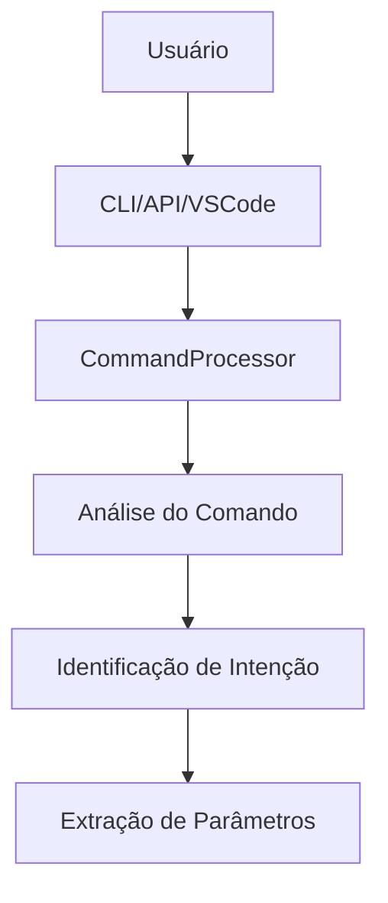
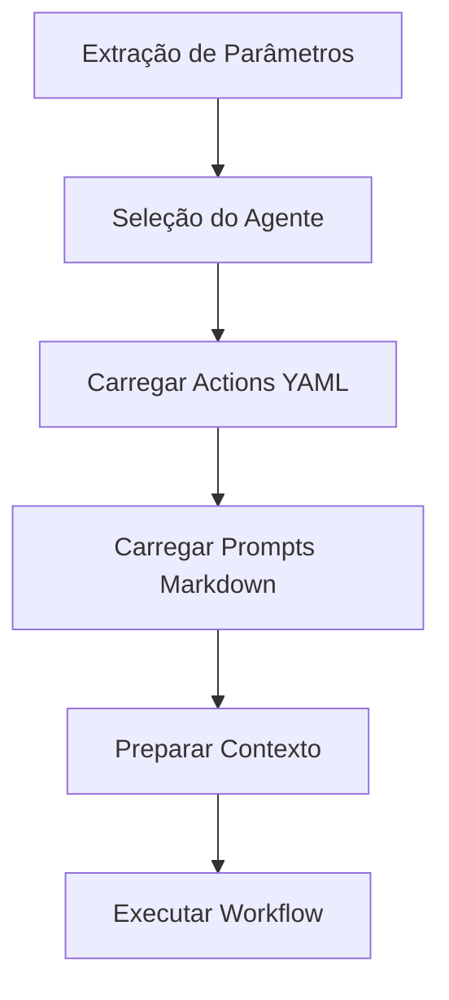
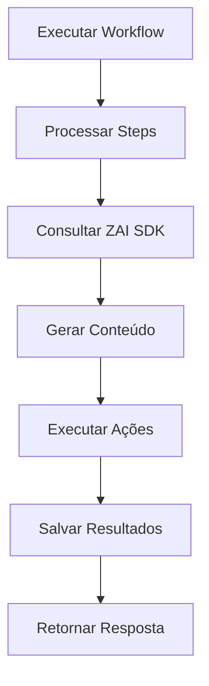
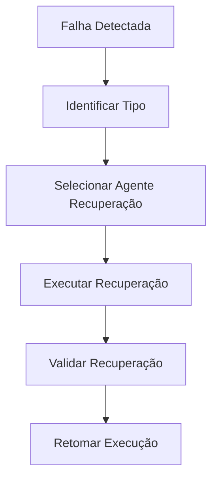
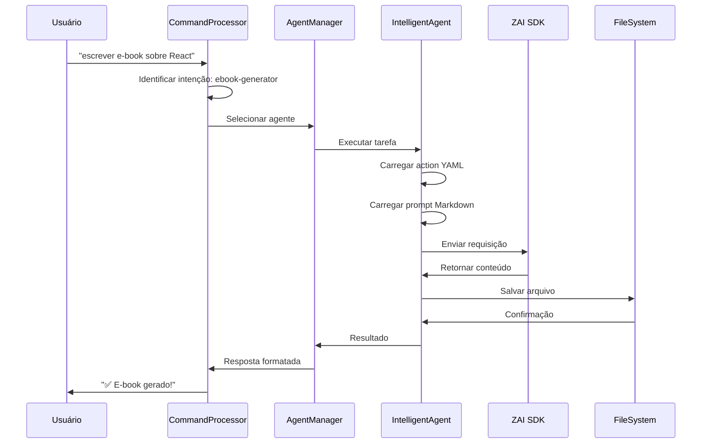

# 🏗️ Arquitetura do Sistema

<div align="center">


**Documentação detalhada da arquitetura e design do Kilo Code**

</div>

---

## 📋 Índice

- [Visão Geral da Arquitetura](#-visão-geral-da-arquitetura)
- [Arquitetura Híbrida YAML + Markdown](#-arquitetura-híbrida-yaml--markdown)
- [Componentes Principais](#-componentes-principais)
- [Fluxo de Dados](#-fluxo-de-dados)
- [Padrões de Design](#-padrões-de-design)
- [Estrutura de Diretórios](#-estrutura-de-diretórios)
- [Integrações](#-integrações)
- [Escalabilidade](#-escalabilidade)
- [Segurança](#-segurança)
- [Performance](#-performance)

---

## 🌐 Visão Geral da Arquitetura

O Kilo Code utiliza uma arquitetura inovadora baseada em **agentes inteligentes** com uma abordagem única de **YAML + Markdown** que separa claramente a lógica de decisão do conhecimento e expressão.

### Princípios Fundamentais

1. **Separação de Responsabilidades**: YAML para lógica/decisão, Markdown para conhecimento/expressão
2. **Agentes Especializados**: Cada agente tem uma responsabilidade específica
3. **Auto-recuperação**: O sistema pode se recuperar de falhas automaticamente
4. **Extensibilidade**: Fácil adicionar novos agentes e funcionalidades
5. **Operação Contínua**: Projetado para operar 24/7 sem supervisão

### Arquitetura em Camadas

```
┌─────────────────────────────────────────────────────────────┐
│                    Interface do Usuário                     │
├─────────────────────────────────────────────────────────────┤
│  CLI Interativa  │  API REST  │  VSCode Integration  │  Web UI  │
├─────────────────────────────────────────────────────────────┤
│                    Camada de Orquestração                   │
├─────────────────────────────────────────────────────────────┤
│              CommandProcessor & Agent Manager                │
├─────────────────────────────────────────────────────────────┤
│                      Agentes Inteligentes                    │
├─────────────────────────────────────────────────────────────┤
│ Main Agent │ Recovery Agents │ Specialized Agents │ Services  │
├─────────────────────────────────────────────────────────────┤
│                  Camada de Conhecimento                      │
├─────────────────────────────────────────────────────────────┤
│    YAML Actions    │    Markdown Prompts    │    Config     │
├─────────────────────────────────────────────────────────────┤
│                   Camada de Infraestrutura                    │
├─────────────────────────────────────────────────────────────┤
│   Node.js Runtime   │   ZAI SDK   │   Database   │   Cache   │
└─────────────────────────────────────────────────────────────┘
```

---

## 🧠 Arquitetura Híbrida YAML + Markdown

### Conceito Central

A arquitetura híbrida é o coração do sistema, onde:

- **YAML (Cérebro)**: Define a lógica, decisões, fluxos e comportamentos
- **Markdown (Corpo)**: Fornece conhecimento, personalidade, contexto e expressão

### Analogia

```
🧠 YAML (Cérebro) = Lógica + Decisão + Comportamento
   - "O QUE fazer"
   - "COMO fazer"
   - "QUANDO fazer"
   - "POR QUE fazer"

📝 Markdown (Corpo) = Conhecimento + Personalidade + Expressão
   - "O QUE sei"
   - "COMO me expresso"
   - "QUAL minha personalidade"
   - "COMO me comunico"
```

### Estrutura YAML

```yaml
# Exemplo de estrutura YAML
agent:
  name: "SpecializedAgent"
  version: "1.0.0"
  capabilities:
    - "Processamento de linguagem natural"
    - "Tomada de decisão autônoma"
  
workflows:
  - name: "MainWorkflow"
    steps:
      - name: "analyze_input"
        type: "analysis"
        parameters:
          input: "${user_input}"
      - name: "execute_action"
        type: "execution"
        depends_on: ["analyze_input"]
  
commands:
  - name: "execute_task"
    description: "Executa uma tarefa específica"
    params:
      - name: "task"
        type: "string"
        required: true
```

### Estrutura Markdown

```markdown
# Specialized Agent - Personalidade e Conhecimento

## Contexto
Eu sou um agente especializado em [área específica] com vasta experiência em [tópicos].

## Personalidade
- Tom: [profissional/didático/criativo]
- Estilo: [técnico/simples/detalhado]
- Foco: [precisão/criatividade/eficiência]

## Conhecimento Especializado
### Área 1
- Conceito importante 1
- Conceito importante 2
- Melhores práticas

### Área 2
- Frameworks e ferramentas
- Padrões de design
- Casos de uso

## Diretrizes de Resposta
1. Sempre começar com análise do contexto
2. Fornecer exemplos práticos
3. Incluir considerações de performance
4. Sugerir próximos passos
```

### Benefícios da Arquitetura Híbrida

| Benefício | YAML | Markdown | Combinado |
|-----------|------|----------|-----------|
| **Manutenção** | Lógica estruturada | Conteúdo legível | Separação clara |
| **Extensibilidade** | Fácil adicionar steps | Fácil adicionar conhecimento | Modularidade |
| **Versionamento** | Controle de versões semântico | Histórico de evolução | Rastreabilidade |
| **Colaboração** | Desenvolvedores | Especialistas de domínio | Trabalho em equipe |
| **Testabilidade** | Testes unitários | Validação de conteúdo | Cobertura completa |

---

## 🔧 Componentes Principais

### 1. CommandProcessor

**Responsabilidade**: Processar comandos em linguagem natural e orquestrar a execução

```javascript
class CommandProcessor {
  constructor() {
    this.actions = new Map();      // Actions YAML carregadas
    this.prompts = new Map();      // Prompts Markdown carregados
    this.zai = null;              // Instância do ZAI SDK
    this.intents = {};            // Mapeamento de intenções
  }
  
  async processCommand(command) {
    // 1. Identificar intenção
    const intent = this.identifyIntent(command);
    
    // 2. Extrair parâmetros
    const parameters = this.extractParameters(command, intent);
    
    // 3. Executar ação
    return await this.executeIntent(intent, parameters);
  }
}
```

### 2. Agent Manager

**Responsabilidade**: Gerenciar o ciclo de vida dos agentes

```javascript
class AgentManager {
  constructor() {
    this.agents = new Map();
    this.activeAgents = new Set();
  }
  
  async loadAgent(agentConfig) {
    const agent = new IntelligentAgent(agentConfig);
    await agent.initialize();
    this.agents.set(agent.name, agent);
  }
  
  async executeAgent(agentName, task) {
    const agent = this.agents.get(agentName);
    return await agent.execute(task);
  }
}
```

### 3. Intelligent Agent

**Responsabilidade**: Agente base com capacidades inteligentes

```javascript
class IntelligentAgent {
  constructor(config) {
    this.name = config.name;
    this.version = config.version;
    this.capabilities = config.capabilities;
    this.actions = [];
    this.prompts = [];
  }
  
  async initialize() {
    // Carregar YAML actions
    await this.loadActions();
    
    // Carregar Markdown prompts
    await this.loadPrompts();
    
    // Inicializar ZAI SDK
    this.zai = await ZAI.create();
  }
  
  async execute(task) {
    // Executar workflow principal
    return await this.executeWorkflow(task);
  }
}
```

### 4. Recovery System

**Responsabilidade**: Sistema de recuperação de falhas

```javascript
class RecoverySystem {
  constructor() {
    this.recoveryAgents = new Map();
    this.failurePatterns = new Map();
  }
  
  async handleFailure(error, context) {
    // 1. Identificar tipo de falha
    const failureType = this.identifyFailureType(error);
    
    // 2. Selecionar agente de recuperação
    const recoveryAgent = this.recoveryAgents.get(failureType);
    
    // 3. Executar recuperação
    return await recoveryAgent.recover(error, context);
  }
}
```

### 5. Semantic Search Service

**Responsabilidade**: Busca semântica avançada

```javascript
class SemanticSearchService {
  constructor() {
    this.indexedFiles = new Map();
    this.vectorStore = null;
  }
  
  async indexFiles(rootPath) {
    // Indexar arquivos para busca semântica
    const files = await this.scanDirectory(rootPath);
    for (const file of files) {
      await this.indexFile(file);
    }
  }
  
  async search(query, options) {
    // Executar busca semântica
    return await this.vectorStore.similaritySearch(query, options);
  }
}
```

---

## 🔄 Fluxo de Dados

### Fluxo Principal de Execução

```
Usuário → CommandProcessor → Agent Manager → Intelligent Agent → Actions/Prompts → ZAI SDK → Resultado
```

### Detalhamento do Fluxo

#### 1. Entrada do Usuário


#### 2. Processamento do Comando


#### 3. Execução da Tarefa


#### 4. Recuperação de Falhas


### Fluxo de Dados em Detalhe



---

## 🎨 Padrões de Design

### 1. Pattern: Agent-Action-Prompt (AAP)

**Descrição**: Cada agente é composto por actions (YAML) e prompts (Markdown)

```javascript
// Implementação do padrão AAP
class AgentActionPrompt {
  constructor(agentConfig) {
    this.agent = agentConfig;
    this.actions = this.loadActions();
    this.prompts = this.loadPrompts();
  }
  
  async execute(task) {
    const action = this.selectAction(task);
    const prompt = this.selectPrompt(action);
    
    return await this.executeAction(action, prompt, task);
  }
}
```

### 2. Pattern: Recovery Chain

**Descrição**: Cadeia de recuperação com múltiplos agentes especializados

```javascript
// Implementação do padrão Recovery Chain
class RecoveryChain {
  constructor() {
    this.chain = [
      new ThoughtRecoveryAgent(),
      new FileSystemValidatorAgent(),
      new TestRecoveryAgent(),
      new FileRecoveryAgent()
    ];
  }
  
  async recover(error, context) {
    for (const agent of this.chain) {
      if (agent.canHandle(error)) {
        const result = await agent.recover(error, context);
        if (result.success) return result;
      }
    }
    throw new Error('Recovery failed');
  }
}
```

### 3. Pattern: Semantic Router

**Descrição**: Roteamento semântico baseado em intenção do usuário

```javascript
// Implementação do padrão Semantic Router
class SemanticRouter {
  constructor() {
    this.routes = new Map();
    this.intentClassifier = new IntentClassifier();
  }
  
  async route(command) {
    const intent = await this.intentClassifier.classify(command);
    const handler = this.routes.get(intent);
    
    if (!handler) {
      throw new Error(`No handler for intent: ${intent}`);
    }
    
    return await handler.handle(command);
  }
}
```

### 4. Pattern: Hybrid Configuration

**Descrição**: Configuração híbrida usando YAML para estrutura e Markdown para conteúdo

```javascript
// Implementação do padrão Hybrid Configuration
class HybridConfiguration {
  constructor(yamlPath, markdownPath) {
    this.yamlConfig = this.loadYAML(yamlPath);
    this.markdownContent = this.loadMarkdown(markdownPath);
  }
  
  getStructuredConfig() {
    return this.yamlConfig;
  }
  
  getContentTemplate() {
    return this.markdownContent;
  }
  
  getCompleteConfig() {
    return {
      ...this.yamlConfig,
      content: this.markdownContent
    };
  }
}
```

### 5. Pattern: Continuous Operation

**Descrição**: Sistema projetado para operação contínua com auto-monitoramento

```javascript
// Implementação do padrão Continuous Operation
class ContinuousOperation {
  constructor() {
    this.healthMonitor = new HealthMonitor();
    this.autoRecovery = new AutoRecovery();
    this.performanceOptimizer = new PerformanceOptimizer();
  }
  
  async start() {
    setInterval(async () => {
      await this.healthMonitor.check();
      await this.performanceOptimizer.optimize();
    }, 60000); // A cada minuto
  }
}
```

---

## 📁 Estrutura de Diretórios

### Estrutura Completa

```
Kilo-Code-Automacao-Template/
├── .killo-workspace/                    # Workspace do agente
│   ├── agent/                          # Configuração do agente
│   │   ├── agent.yaml                  # Configuração central
│   │   ├── actions/                    # Lógica de execução (YAML)
│   │   │   ├── bootstrap-project.yaml
│   │   │   ├── write-file.yaml
│   │   │   ├── read-directory.yaml
│   │   │   ├── audit-all.yaml
│   │   │   ├── recover-failure.yaml
│   │   │   ├── thought-recovery.yaml
│   │   │   ├── file-system-validator.yaml
│   │   │   ├── test-recovery.yaml
│   │   │   └── file-recovery.yaml
│   │   └── prompts/                    # Conhecimento (Markdown)
│   │       ├── ebook-generator.md
│   │       ├── api-generator.md
│   │       ├── dashboard-generator.md
│   │       ├── project-bootstrap.md
│   │       ├── error-recovery.md
│   │       ├── thought-recovery.md
│   │       ├── file-system-validator.md
│   │       ├── test-recovery.md
│   │       └── file-recovery.md
│   ├── scripts/                        # Scripts de automação
│   │   ├── killo-init.sh
│   │   ├── killo-recover.sh
│   │   ├── killo-bootstrap.sh
│   │   ├── auto-setup.js
│   │   ├── project-setup.js
│   │   ├── integrate-smart.js
│   │   └── security-check.js
│   └── health-check/                   # Sistema de verificação
│       └── project-scanner.js
├── src/                                # Código fonte
│   ├── app.js                          # Servidor web principal
│   ├── cli/                            # Interface CLI
│   │   └── killo-cli.js
│   ├── config/                         # Configurações
│   │   ├── cache.js
│   │   ├── database.js
│   │   ├── security.js
│   │   └── logging.js
│   ├── services/                       # Serviços do sistema
│   │   ├── commandProcessor.js
│   │   ├── semanticSearchService.js
│   │   └── agentManager.js
│   └── utils/                          # Utilitários
│       ├── errorHandler.js
│       ├── fileUtils.js
│       └── validationUtils.js
├── docs/                               # Documentação
│   ├── INSTALLATION.md
│   ├── COMMANDS.md
│   ├── ARCHITECTURE.md
│   ├── AGENTS.md
│   ├── DEVELOPMENT.md
│   ├── TROUBLESHOOTING.md
│   ├── EXAMPLES.md
│   └── CONTRIBUTING.md
├── scripts/                            # Scripts externos
│   ├── kindex-fast.sh
│   ├── ksearch.sh
│   └── kread.sh
├── output/                             # Saída gerada
│   ├── ebooks/                         # E-books gerados
│   ├── apis/                           # APIs geradas
│   ├── dashboards/                     # Dashboards gerados
│   └── projects/                       # Projetos criados
├── projects/                           # Projetos criados
├── logs/                               # Logs do sistema
├── temp/                               # Arquivos temporários
├── data/                               # Dados persistentes
│   └── kilo.db                        # Banco de dados SQLite
├── tests/                              # Testes
│   ├── unit/                          # Testes unitários
│   ├── integration/                   # Testes de integração
│   └── e2e/                           # Testes end-to-end
├── .env.example                       # Variáveis de ambiente exemplo
├── .gitignore                         # Arquivos ignorados pelo Git
├── killo.config                       # Configuração do Killo
├── package.json                       # Dependências do projeto
├── package-lock.json                  # Lock de dependências
├── README.md                          # Documentação principal
└── LICENSE                            # Licença do projeto
```

### Propósito de Cada Diretório

| Diretório | Propósito | Conteúdo |
|-----------|----------|----------|
| `.killo-workspace/` | Workspace do agente | Configurações, actions, prompts |
| `src/` | Código fonte | Implementação do sistema |
| `docs/` | Documentação | Manuais, guias, referências |
| `scripts/` | Scripts externos | Automação, busca semântica |
| `output/` | Saída gerada | Resultados das operações |
| `projects/` | Projetos criados | Projetos gerados pelo sistema |
| `logs/` | Logs do sistema | Registro de operações |
| `temp/` | Arquivos temporários | Arquivos temporários de processamento |
| `data/` | Dados persistentes | Banco de dados, cache |
| `tests/` | Testes | Suíte de testes automatizados |

---

## 🔌 Integrações

### 1. VSCode Integration

```javascript
// Integração com VSCode
class VSCodeIntegration {
  constructor() {
    this.workspaceVars = {
      workspaceFolder: '${workspaceFolder}',
      file: '${file}',
      lineNumber: '${lineNumber}',
      selectedText: '${selectedText}',
      gitBranch: '${gitBranch}',
      env: '${env}'
    };
  }
  
  async executeInVSCode(command) {
    // Executar comando no VSCode
    const vscode = require('vscode');
    return await vscode.commands.executeCommand(command);
  }
}
```

### 2. GitHub Integration

```javascript
// Integração com GitHub
class GitHubIntegration {
  constructor(token) {
    this.octokit = new Octokit({ auth: token });
  }
  
  async createPR(title, body, files) {
    // Criar Pull Request
    const pr = await this.octokit.pulls.create({
      owner: 'OARANHA',
      repo: 'Kilo-Code-Automacao-Template',
      title,
      body,
      head: 'feature-branch',
      base: 'main'
    });
    
    return pr;
  }
}
```

### 3. Docker Integration

```javascript
// Integração com Docker
class DockerIntegration {
  constructor() {
    this.docker = new Docker();
  }
  
  async buildImage(dockerfilePath, imageName) {
    // Construir imagem Docker
    const stream = await this.docker.buildImage({
      context: __dirname,
      src: [dockerfilePath]
    }, { t: imageName });
    
    return await this.followStream(stream);
  }
}
```

### 4. AWS Integration

```javascript
// Integração com AWS
class AWSIntegration {
  constructor(credentials) {
    this.aws = new AWS.SDK(credentials);
  }
  
  async deployLambda(functionName, code) {
    // Deploy função Lambda
    const lambda = new this.aws.Lambda();
    return await lambda.createFunction({
      FunctionName: functionName,
      Runtime: 'nodejs16.x',
      Handler: 'index.handler',
      Code: { ZipFile: code }
    }).promise();
  }
}
```

### 5. Kubernetes Integration

```javascript
// Integração com Kubernetes
class KubernetesIntegration {
  constructor(kubeconfig) {
    this.k8s = new Kubernetes.Client({ kubeconfig });
  }
  
  async deployDeployment(deployment) {
    // Deploy no Kubernetes
    return await this.k8s.apis.apps.v1.namespaces('default')
      .deployments.post({ body: deployment });
  }
}
```

---

## 📈 Escalabilidade

### Estratégias de Escalabilidade

#### 1. Escalabilidade Horizontal

```javascript
// Escalabilidade horizontal com múltiplos processos
class HorizontalScaler {
  constructor() {
    this.workers = [];
    this.taskQueue = new TaskQueue();
  }
  
  async scaleUp(count) {
    for (let i = 0; i < count; i++) {
      const worker = new Worker('./src/worker.js');
      this.workers.push(worker);
    }
  }
  
  async distributeTask(task) {
    const availableWorker = this.getAvailableWorker();
    return await availableWorker.execute(task);
  }
}
```

#### 2. Escalabilidade Vertical

```javascript
// Escalabilidade vertical com otimização de recursos
class VerticalScaler {
  constructor() {
    this.resourceMonitor = new ResourceMonitor();
    this.optimizer = new ResourceOptimizer();
  }
  
  async optimizeResources() {
    const metrics = await this.resourceMonitor.getMetrics();
    return await this.optimizer.optimize(metrics);
  }
}
```

#### 3. Escalabilidade de Dados

```javascript
// Escalabilidade de dados com sharding
class DataScaler {
  constructor() {
    this.shards = new Map();
    this.shardStrategy = new ShardStrategy();
  }
  
  async getShard(key) {
    const shardId = this.shardStrategy.getShardId(key);
    if (!this.shards.has(shardId)) {
      this.shards.set(shardId, new DataShard(shardId));
    }
    return this.shards.get(shardId);
  }
}
```

### Padrões de Escalabilidade

| Padrão | Descrição | Implementação |
|--------|-----------|---------------|
| **Load Balancing** | Distribuição de carga | Múltiplos workers com round-robin |
| **Caching** | Cache distribuído | Redis com replicação |
| **Database Sharding** | Particionamento de dados | Sharding por ID ou hash |
| **Microservices** | Serviços independentes | Contêineres Docker com Kubernetes |
| **Event Sourcing** | Eventos como fonte de verdade | Kafka com consumidores |

---

## 🔒 Segurança

### Camadas de Segurança

#### 1. Segurança de Aplicação

```javascript
// Segurança de aplicação
class ApplicationSecurity {
  constructor() {
    this.rateLimiter = new RateLimiter();
    this.inputValidator = new InputValidator();
    this.xssProtection = new XSSProtection();
  }
  
  async secureRequest(req, res, next) {
    // Rate limiting
    await this.rateLimiter.check(req.ip);
    
    // Input validation
    this.inputValidator.validate(req.body);
    
    // XSS protection
    this.xssProtection.sanitize(req.body);
    
    next();
  }
}
```

#### 2. Segurança de Dados

```javascript
// Segurança de dados
class DataSecurity {
  constructor() {
    this.encryptor = new Encryptor();
    this.hasher = new Hasher();
  }
  
  async encryptData(data) {
    return await this.encryptor.encrypt(data);
  }
  
  async hashPassword(password) {
    return await this.hasher.hash(password);
  }
}
```

#### 3. Segurança de Rede

```javascript
// Segurança de rede
class NetworkSecurity {
  constructor() {
    this.firewall = new Firewall();
    this.cors = new CORS();
    this.helmet = new Helmet();
  }
  
  setupSecurity(app) {
    app.use(this.cors());
    app.use(this.helmet());
    app.use(this.firewall);
  }
}
```

### Práticas de Segurança

| Prática | Descrição | Implementação |
|---------|-----------|---------------|
| **Input Validation** | Validação de entrada | Joi ou express-validator |
| **Output Encoding** | Codificação de saída | DOMPurify ou escape |
| **Authentication** | Autenticação de usuários | JWT ou OAuth |
| **Authorization** | Controle de acesso | RBAC ou ABAC |
| **Encryption** | Criptografia de dados | AES-256 ou RSA |
| **Audit Logging** | Registro de auditoria | Winston ou Morgan |

---

## ⚡ Performance

### Estratégias de Otimização

#### 1. Otimização de Código

```javascript
// Otimização de código com caching
class PerformanceOptimizer {
  constructor() {
    this.cache = new Cache();
    this.profiler = new Profiler();
  }
  
  async optimizeFunction(fn, key) {
    const cached = this.cache.get(key);
    if (cached) return cached;
    
    const result = await this.profiler.profile(fn);
    this.cache.set(key, result);
    
    return result;
  }
}
```

#### 2. Otimização de Banco de Dados

```javascript
// Otimização de banco de dados
class DatabaseOptimizer {
  constructor() {
    this.queryOptimizer = new QueryOptimizer();
    this.indexManager = new IndexManager();
  }
  
  async optimizeQuery(query) {
    return await this.queryOptimizer.optimize(query);
  }
  
  async createIndexes() {
    return await this.indexManager.createIndexes();
  }
}
```

#### 3. Otimização de Memória

```javascript
// Otimização de memória
class MemoryOptimizer {
  constructor() {
    this.memoryMonitor = new MemoryMonitor();
    this.garbageCollector = new GarbageCollector();
  }
  
  async optimizeMemory() {
    const usage = await this.memoryMonitor.getUsage();
    if (usage > 80) {
      await this.garbageCollector.collect();
    }
  }
}
```

### Métricas de Performance

| Métrica | Descrição | Meta | Monitoramento |
|---------|-----------|------|---------------|
| **Response Time** | Tempo de resposta | < 200ms | Prometheus |
| **Throughput** | Requisições por segundo | > 1000 RPS | Grafana |
| **Memory Usage** | Uso de memória | < 512MB | New Relic |
| **CPU Usage** | Uso de CPU | < 70% | Datadog |
| **Error Rate** | Taxa de erros | < 1% | Sentry |

---

<div align="center">

**🎉 Parabéns! Agora você entende a arquitetura completa do Kilo Code!**

Esta arquitetura inovadora permite criar sistemas inteligentes, escaláveis e auto-recuperáveis.

</div>